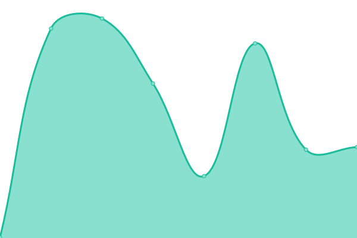
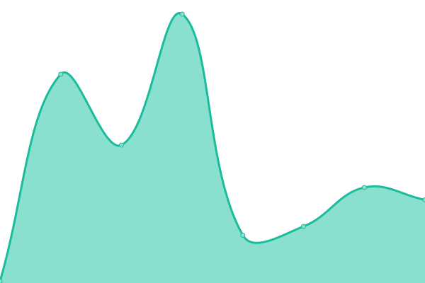
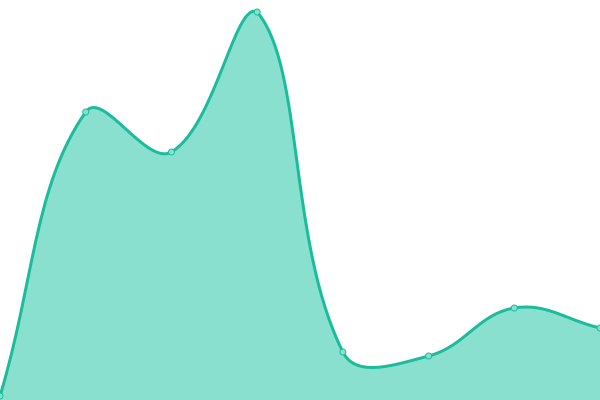
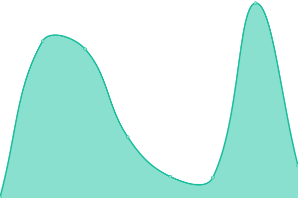

# [📈 Live Status](https://NigarumOvum.github.io/upptime): <!--live status--> **🟧 Partial outage**

This repository contains the open-source uptime monitor and status page for [Brealy Fabian Padron Rodriguez](https://neighbordevcr.com), powered by [Upptime](https://github.com/upptime/upptime).

With [Upptime](https://upptime.js.org), you can get your own unlimited and free uptime monitor and status page, powered entirely by a GitHub repository. We use [Issues](https://github.com/NigarumOvum/upptime/issues) as incident reports, [Actions](https://github.com/NigarumOvum/upptime/actions) as uptime monitors, and [Pages](https://NigarumOvum.github.io/upptime) for the status page.

<!--start: status pages-->
<!-- This summary is generated by Upptime (https://github.com/upptime/upptime) -->
<!-- Do not edit this manually, your changes will be overwritten -->
<!-- prettier-ignore -->
| URL | Status | History | Response Time | Uptime |
| --- | ------ | ------- | ------------- | ------ |
|  [Brealy Portfolio](https://brealypadronrodriguez.vercel.app/) | 🟩 Up | [brealy-portfolio.yml](https://github.com/NigarumOvum/Site-Monitoring-Svelte/commits/HEAD/history/brealy-portfolio.yml) | 

 158ms
     
 | 

<a href="https://nigarumovum.github.io/Site-Monitoring-Svelte/history/brealy-portfolio">100.00%</a>
    

|  [MacOS Portfolio](https://mac-os-desktop-app-react.vercel.app/) | 🟥 Down | [mac-os-portfolio.yml](https://github.com/NigarumOvum/Site-Monitoring-Svelte/commits/HEAD/history/mac-os-portfolio.yml) | 

 137ms
     
 | 

<a href="https://nigarumovum.github.io/Site-Monitoring-Svelte/history/mac-os-portfolio">0.00%</a>
    

|  [Neighbordev CR](https://neighbordevcr.com/) | 🟩 Up | [neighbordev-cr.yml](https://github.com/NigarumOvum/Site-Monitoring-Svelte/commits/HEAD/history/neighbordev-cr.yml) | 

 226ms
     
 | 

<a href="https://nigarumovum.github.io/Site-Monitoring-Svelte/history/neighbordev-cr">100.00%</a>
    

|  [Chat App](https://streamchat-node-production.up.railway.app/) | 🟥 Down | [chat-app.yml](https://github.com/NigarumOvum/Site-Monitoring-Svelte/commits/HEAD/history/chat-app.yml) | 

 225ms
     
 | 

<a href="https://nigarumovum.github.io/Site-Monitoring-Svelte/history/chat-app">0.00%</a>
    

|  [Drum Web App](https://nigarumovum.github.io/DrumKit-WebApp/) | 🟩 Up | [drum-web-app.yml](https://github.com/NigarumOvum/Site-Monitoring-Svelte/commits/HEAD/history/drum-web-app.yml) | 

 108ms
     
 | 

<a href="https://nigarumovum.github.io/Site-Monitoring-Svelte/history/drum-web-app">100.00%</a>
    

|  [3D CHEST](https://nigarumovum.github.io/3DChest/) | 🟩 Up | [3-d-chest.yml](https://github.com/NigarumOvum/Site-Monitoring-Svelte/commits/HEAD/history/3-d-chest.yml) | 

 84ms
     
 | 

<a href="https://nigarumovum.github.io/Site-Monitoring-Svelte/history/3-d-chest">100.00%</a>
    

|  [Trip in CR](https://tripincr.vercel.app) | 🟩 Up | [trip-in-cr.yml](https://github.com/NigarumOvum/Site-Monitoring-Svelte/commits/HEAD/history/trip-in-cr.yml) | 

 0ms
     
 | 

<a href="https://nigarumovum.github.io/Site-Monitoring-Svelte/history/trip-in-cr">100.00%</a>
    

|  [Tarotly](https://tarotly-react.vercel.app) | 🟩 Up | [tarotly.yml](https://github.com/NigarumOvum/Site-Monitoring-Svelte/commits/HEAD/history/tarotly.yml) | 

 132ms
     
 | 

<a href="https://nigarumovum.github.io/Site-Monitoring-Svelte/history/tarotly">100.00%</a>
    

|  [BookFreak](https://book-freak-react.vercel.app) | 🟩 Up | [book-freak.yml](https://github.com/NigarumOvum/Site-Monitoring-Svelte/commits/HEAD/history/book-freak.yml) | 

 178ms
     
 | 

<a href="https://nigarumovum.github.io/Site-Monitoring-Svelte/history/book-freak">100.00%</a>
    

|  [Shopping Cart - React](https://shopping-cart-three-omega.vercel.app/) | 🟥 Down | [shopping-cart-react.yml](https://github.com/NigarumOvum/Site-Monitoring-Svelte/commits/HEAD/history/shopping-cart-react.yml) | 

 133ms
     
 | 

<a href="https://nigarumovum.github.io/Site-Monitoring-Svelte/history/shopping-cart-react">0.00%</a>
    

|  [Servicing React](https://servicing-react.vercel.app/) | 🟩 Up | [servicing-react.yml](https://github.com/NigarumOvum/Site-Monitoring-Svelte/commits/HEAD/history/servicing-react.yml) | 

 144ms
     
 | 

<a href="https://nigarumovum.github.io/Site-Monitoring-Svelte/history/servicing-react">100.00%</a>
    

|  [Social Media React](https://social-media-react-mu.vercel.app/) | 🟥 Down | [social-media-react.yml](https://github.com/NigarumOvum/Site-Monitoring-Svelte/commits/HEAD/history/social-media-react.yml) | 

 108ms
     
 | 

<a href="https://nigarumovum.github.io/Site-Monitoring-Svelte/history/social-media-react">0.00%</a>
    

|  [NASA Explorer](https://nasa-app-api.vercel.app) | 🟩 Up | [nasa-explorer.yml](https://github.com/NigarumOvum/Site-Monitoring-Svelte/commits/HEAD/history/nasa-explorer.yml) | 

 134ms
     
 | 

<a href="https://nigarumovum.github.io/Site-Monitoring-Svelte/history/nasa-explorer">100.00%</a>
    

|  [Expense Tracker](https://expense-tracker-vert.vercel.app) | 🟩 Up | [expense-tracker.yml](https://github.com/NigarumOvum/Site-Monitoring-Svelte/commits/HEAD/history/expense-tracker.yml) | 

 125ms
     
 | 

<a href="https://nigarumovum.github.io/Site-Monitoring-Svelte/history/expense-tracker">100.00%</a>
    

|  [Song Lyric Browser](https://lyric-search-eosin.vercel.app) | 🟩 Up | [song-lyric-browser.yml](https://github.com/NigarumOvum/Site-Monitoring-Svelte/commits/HEAD/history/song-lyric-browser.yml) | 

 151ms
     
 | 

<a href="https://nigarumovum.github.io/Site-Monitoring-Svelte/history/song-lyric-browser">100.00%</a>
    

|  [Meal Finder](https://meal-finder-sandy.vercel.app/) | 🟩 Up | [meal-finder.yml](https://github.com/NigarumOvum/Site-Monitoring-Svelte/commits/HEAD/history/meal-finder.yml) | 

 144ms
     
 | 

<a href="https://nigarumovum.github.io/Site-Monitoring-Svelte/history/meal-finder">100.00%</a>
    

|  [Exchange Rate Calculator](https://exchange-rate-tau.vercel.app/) | 🟩 Up | [exchange-rate-calculator.yml](https://github.com/NigarumOvum/Site-Monitoring-Svelte/commits/HEAD/history/exchange-rate-calculator.yml) | 

 125ms
     
 | 

<a href="https://nigarumovum.github.io/Site-Monitoring-Svelte/history/exchange-rate-calculator">100.00%</a>
    

|  [WebApps & Games](https://web-apps-games.vercel.app/) | 🟩 Up | [web-apps-and-games.yml](https://github.com/NigarumOvum/Site-Monitoring-Svelte/commits/HEAD/history/web-apps-and-games.yml) | 

 112ms
     
 | 

<a href="https://nigarumovum.github.io/Site-Monitoring-Svelte/history/web-apps-and-games">100.00%</a>
    

<!--end: status pages-->

[**Visit our status website →**](https://NigarumOvum.github.io/upptime)

## 📄 License

- Powered by: [Upptime](https://github.com/upptime/upptime)
- Code: [MIT](./LICENSE) © [Brealy Fabian Padron Rodriguez](https://neighbordevcr.com)
- Data in the `./history` directory: [Open Database License](https://opendatacommons.org/licenses/odbl/1-0/)
